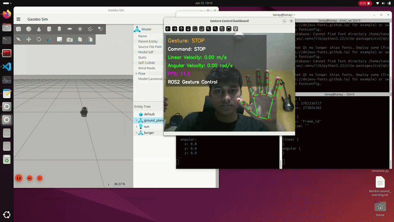
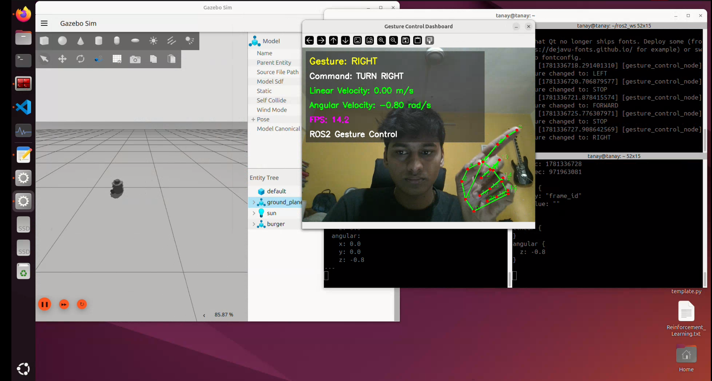
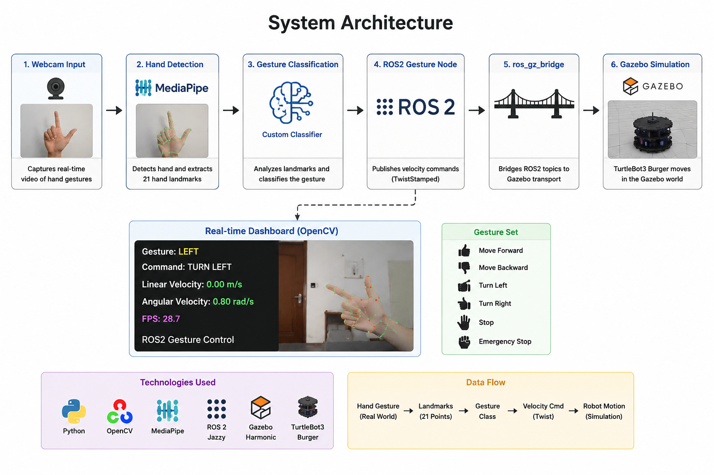

# ROS2 Gesture Control for TurtleBot3

Real-time hand gesture control of TurtleBot3 Burger in Gazebo using MediaPipe, OpenCV and ROS2 Jazzy.



---

## Dashboard

The system includes a real-time visual dashboard displaying:

- Hand landmarks
- Detected gesture
- Robot command
- Linear velocity
- Angular velocity
- FPS counter



---

## System Architecture



The system converts hand gestures into robot motion commands through a ROS2 pipeline.

```text
Webcam
   ↓
MediaPipe Hand Detection
   ↓
Landmark Extraction
   ↓
Gesture Classification
   ↓
ROS2 Gesture Node
   ↓
TwistStamped Commands
   ↓
ros_gz_bridge
   ↓
TurtleBot3 Gazebo
```

---

## Features

- Real-time hand tracking using MediaPipe
- 21-point hand landmark extraction
- Custom gesture classification
- Gesture stabilization using temporal filtering
- ROS2 Jazzy integration
- TurtleBot3 Burger control in Gazebo
- Real-time OpenCV dashboard
- Emergency stop functionality
- TwistStamped command publishing

---

## Supported Gestures

| Gesture | Action |
|----------|----------|
| 👍 Thumb Up | Move Forward |
| 👎 Thumb Down | Move Backward |
| 👈 Point Left | Turn Left |
| 👉 Point Right | Turn Right |
| ✋ Open Palm | Stop |
| ✊ Fist | Emergency Stop |

---

## Technologies Used

- Python
- OpenCV
- MediaPipe
- ROS2 Jazzy
- Gazebo Harmonic
- TurtleBot3 Burger

---

## Installation

### Clone Repository

```bash
git clone https://github.com/YOUR_USERNAME/ros2-gesture-control-turtlebot3.git

cd ros2-gesture-control-turtlebot3
```

### Install Dependencies

```bash
pip install -r requirements.txt
```

### Build ROS2 Package

```bash
colcon build --packages-select gesture_control

source install/setup.bash
```

---

## Running the Project

### Launch TurtleBot3 Simulation

```bash
export TURTLEBOT3_MODEL=burger

ros2 launch turtlebot3_gazebo empty_world.launch.py
```

### Run Gesture Control Node

```bash
python -m gesture_control.gesture_node
```

---

## Project Structure

```text
ros2-gesture-control-turtlebot3/
│
├── gesture_control/
│   ├── hand_detector.py
│   ├── gesture_classifier.py
│   └── gesture_node.py
│
├── docs/
│   ├── demo.gif
│   ├── architecture.png
│   └── dashboard.png
│
├── README.md
├── requirements.txt
├── LICENSE
└── .gitignore
```

---

## Future Improvements

- Dynamic gesture recognition
- Nav2 integration
- Gesture-based waypoint selection
- Real robot deployment
- Gesture-based mode switching

---

## Demo Environment

- Ubuntu 24.04
- ROS2 Jazzy
- Gazebo Harmonic
- TurtleBot3 Burger (Simulation)

---

## Author

**Tanay Baisware**

